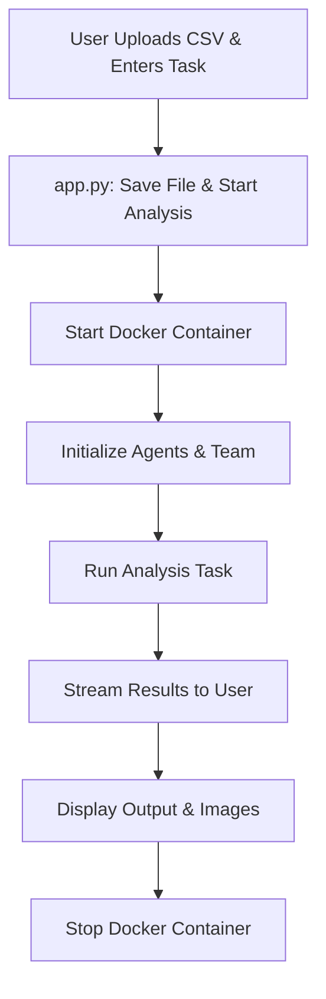

# Analyzer GPT

This project implements Analyzer GPT, an AI-powered digital data analysis agent. It enables users to upload datasets, request analyses, and receive results—including code, charts, and explanations—directly in an interactive interface. The system is designed for data scientists, analysts, and anyone needing automated insights from data.

## Project Overview

- **Purpose**: To automate data analysis tasks, making advanced analytics accessible to non-experts and accelerating workflows for professionals.
- **Features**:
  - Accepts CSV uploads and natural language analysis requests.
  - Uses secure Docker containers to execute code safely.
  - Employs multiple agents for data analysis, code execution, and result interpretation.
  - Streams results (text, images, charts) back to the user in real time.
  - Supports state saving and resuming for long or complex analyses.
- **Example Use Cases**:
  - A business analyst uploads sales data and asks for trends and forecasts.
  - A student wants to visualize and summarize a scientific dataset.
  - A data scientist needs to prototype and test analysis scripts quickly.

---

## System Architecture and Workflow

1. **User uploads a CSV file and enters an analysis task.**
2. **`app.py`**: Handles file upload, task input, and orchestrates the analysis process.
3. **Docker Integration**: Uses Docker (via `config/docker_utils.py`) to securely execute code in an isolated environment.
4. **Agent Team**: The analysis is performed by a team of agents (see `teams/` and `agents/`), each with specialized roles (e.g., data analysis, code execution).
5. **Model Client**: Language model interactions are managed by `models/google_model_client.py`.
6. **Prompts**: Custom prompts in `prompts/` guide agent behavior for specific analysis tasks.
7. **Results**: Outputs (including images) are streamed back to the user and displayed in the interface.
8. **State Management**: Agent and team state can be saved and restored for continuity.

### Flowchart: Analyzer GPT Data Analysis Flow

## Folder Structure and Purpose

- **app.py, main.py**: Main application logic and entry points.
- **agents/**: Defines the agents responsible for code execution and data analysis.
- **config/**: Contains configuration utilities, including Docker integration for secure and reproducible execution.
- **models/**: Implements model clients for interacting with language models.
- **prompts/**: Stores prompt templates that guide agent behavior and responses.
- **teams/**: Manages agent teams and their collaborative workflows.
- **temp/**: Temporary storage for uploaded datasets and generated outputs (e.g., images, CSVs).

## What You Will Learn
- How to build a secure, modular, and collaborative data analysis agent.
- How to use Docker for safe code execution.
- How to manage agent teams and state for complex tasks.
- How to design prompts and workflows for interactive data analysis.

By reading this README and exploring the files, you will gain a clear understanding of how to design, deploy, and extend a data analysis agent system using AutoGen.
